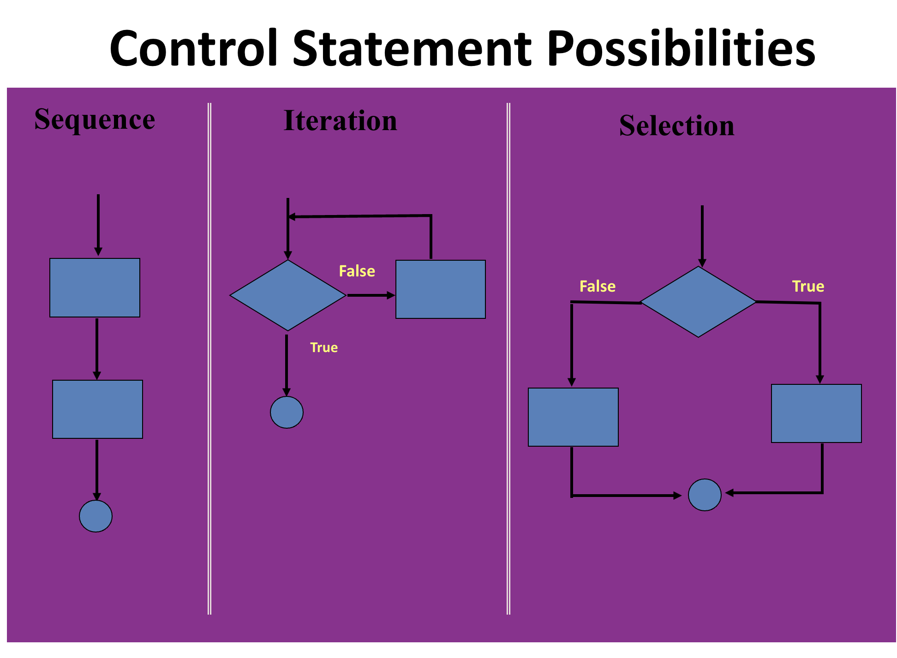
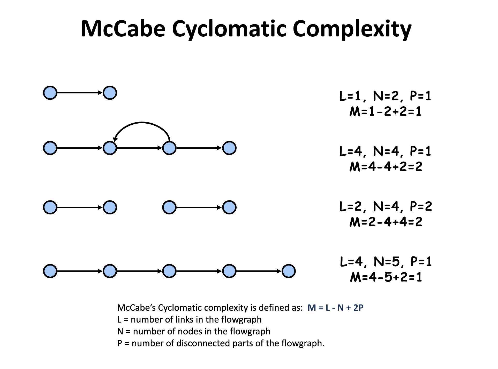

### Control Statement Possibilities:

1. Sequence: Simple run through a written code
2. Iteration:
    1. While/do-while:
        1. The difference between do-while and while is that do-while evaluates its expression at the bottom of the loop instead of the top. Therefore the statements within the do block are always executed at least once. 
    2. For Statement:
        1. Initialization
        2. termination expression
        3. increment step size
3. Selection:
    1. If - Then Statement
    2. If - Then - Else Statement
    3. Switch Statement: 
        1. Switch Statement tests an expression whereas If statement evalutes a condition so can take up more computation and processing. On the other hand, if statements are better for when all switch cases are not easy to include or more granulity is needed. 
        2. A switch works with the byte, short, char, and int primitive data types (most basic), enumerated types,string and classes.
        3. Unlike if-then and if-then-else statements, the switch statement can have a number of possible execution paths. 
    
### Software Metrics:
Software/Source Line Of Code is inaccurate to predict:
- Code efficiency​
- Code Reliability​
- Code Complexity
It's good for measuring the weight of the program.
### McCabe Cyclomatic Complexity:
- It measures the number of linearly independent paths through the programs source code:

# Questions:
1. How to calculate the disconnected parts in McCabe 