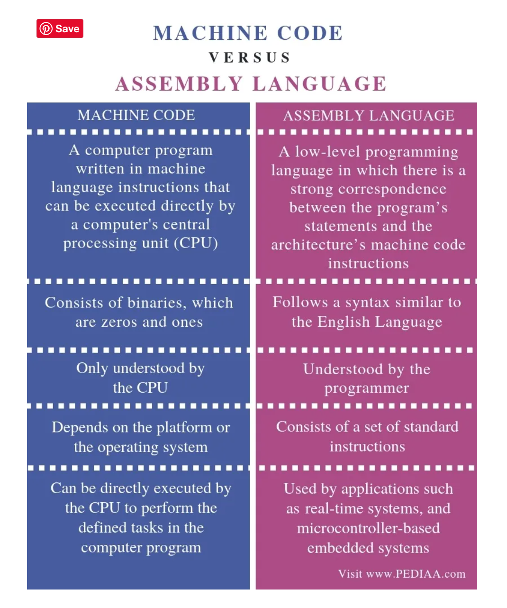
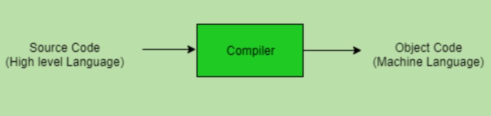
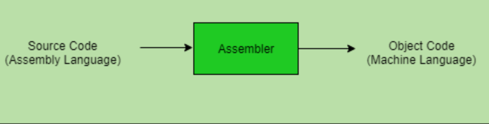
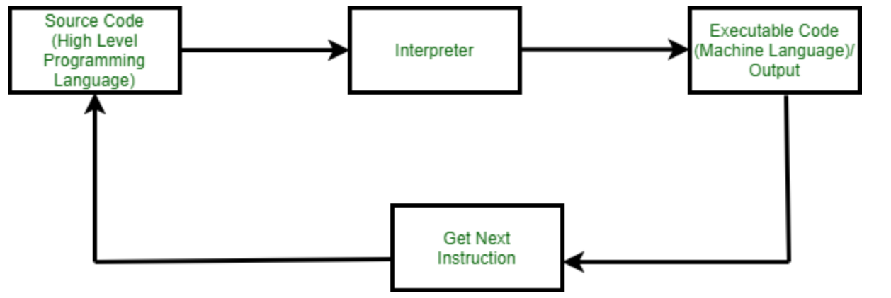
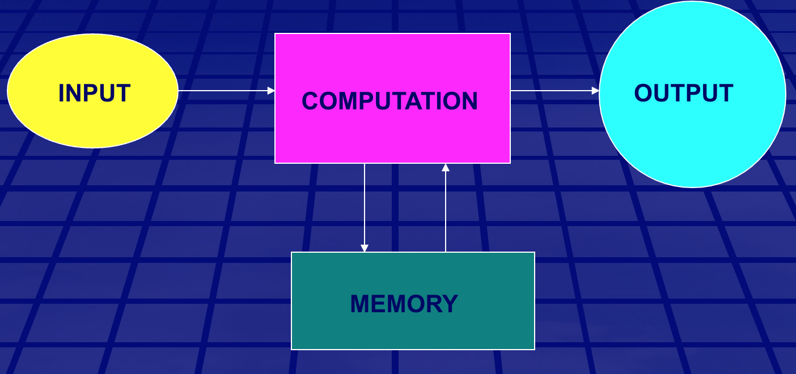
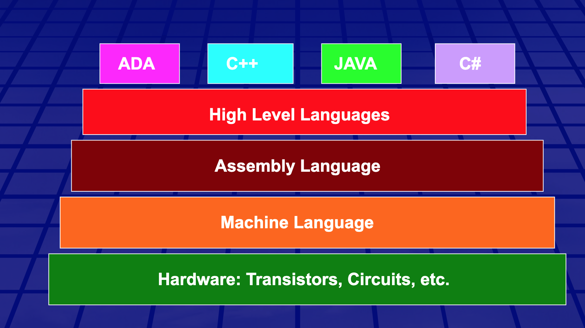

# Module IV Summary:

## Assembly Vs Machine Code:

The main difference between machine code and assembly language is that the machine code is a language that consists of binaries that can be directly executed by a computer while an assembly language is a low-level programming language that requires a software called an assembler to convert it into machine code.

### Differences:

1. Syntax: Machine code consists of binaries, which are zeros and ones. Assembly language, on the other hand, follows a syntax similar to the English Language. Therefore, this is a major difference between machine code and assembly language.
2. Comprehensibility
   Only the CPU understands the machine code; however, the programmer understands the assembly language.
3. Dependency: Another difference between machine code and assembly language is that the machine code depends on the platform or the operating system. But, assembly language consists of a set of standard instructions.
4. Usage
   Considering the usage, the CPU can directly execute the machine code to perform the defined tasks in the computer program. On the other hand, real-time systems, and microcontroller-based embedded systems are some examples of applications using assembly language.

## Language Processors (Translators): Assembler, Compiler and Interpreter

1. Compilers: High level to machine level directly all the way
   
2. Assemblers:
   
3. Interpreters: One line at a time:
   

### Differences between Compilers and Intrepreters:

| compilers                                    |          Interpreters           |
| -------------------------------------------- | :-----------------------------: |
| analyze and then execute                     | execute as analyze line by line |
| shorter execution time                       |      shorter analysis time      |
| more memory required to generate object code |      easier for debugging       |
| more secured                                 |   no intermediate object code   |

## Integrated Circuits (ICs):

The real "meat" to an IC is a complex layering of semiconductor wafers, copper, and other materials, which interconnect to form transistors, resistors or other components in a circuit. The cut
and formed combination of these wafers is called a die.

### Common ICs:

1. Logic Gates
2. Timers
3. Shift registers
4. Microcontrollers, Microprocessors, FPGAs
5. Sensors

## Conditional Structures:

1. Conditionals
2. Case Statements
3. Looping Structures:
   1. entry condition​: expression evaluated before code is executed​ (preferred form of loop control)​
   2. exit condition​: expression is evaluated after code is executed​
   3. nested loops: loop inside another loop(s)​, evaluated outer loop to inner loop.
4. Iteration which is achieved through loops

## Programming Languages:

1. Input/output: 
2. High level to Machine Code:
   

## Assignments:

1. What is an integrated circuit? Integrated circuits (IC)s are tiny layered semiconductor wafer on which there are millions of different components such as transistors, resistors, capacitors and etc. ICs are the fundamental piece in building modern electronic devices and have so many uses such as: logic gates, timers, shift registers and etc.

2. Describe the parts of an integrated circuit. The main part to an IC is a complicated layered of semiconductor wafers, copper, and other materials (the formed combination of these wafers is called a die). They connect to form different components such as transistors. Then there's the packaging part that covers the thin die and add pads so we can easily connect and solder our connections points to it. The packaging also comes in different formats based on their mounting styles like: surface mount, dual inline packages and etc.

3. What are integrated circuits used for? They are so prevalent that it's hard to limit them to just some use cases but some examples are: logic gates, shift registers, timers, counters, oscillators, microcontrollers, sensors, FPGAs and etc.

4. What type of logic are integrated circuits made of? ICs are made of both sequential and combinational logic circuits. They also can be considered in categories like digital, analog and mixed signals (both digital and analog signaling on the same IC).

## Questions:

1. Iterations vs Looping
2. Quad input AND gate
3. Machine code to high level language
